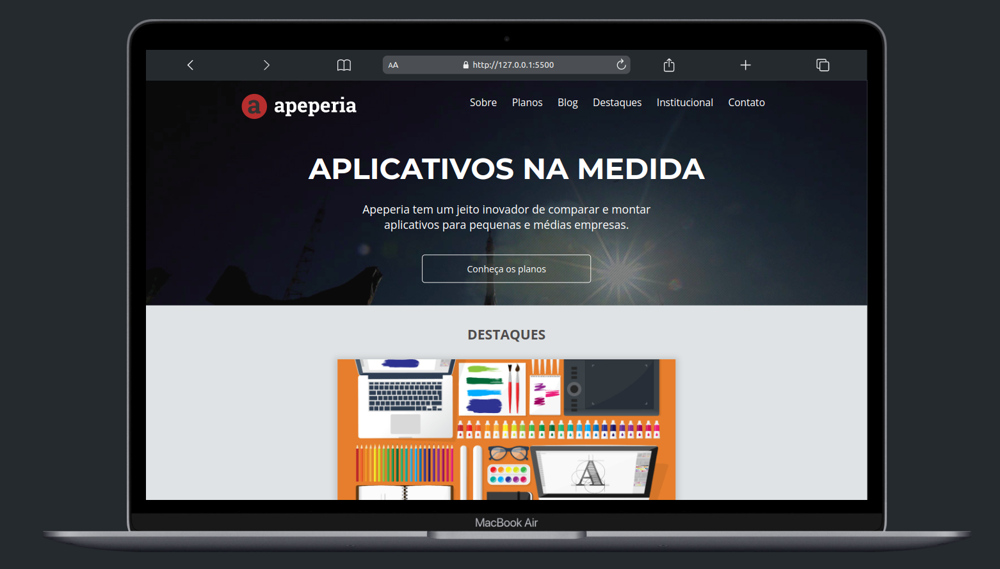

# Projeto-apeperia

---

### Descrição

Esta é uma página web simples criada com HTML e CSS, desenvolvida com base nas aulas do curso da Alura em parceria com o Grupo Boticário.

<h1 align="center">
  
  
  

</h1>

---

### Requisitos para utilização deste projeto:

- Ter um ambiente de desenvolvimento instalado, com suporte à linguagem HTML e CSS;
- Ter acesso ao Git, para realizar o clone do repositório deste projeto;
- Possuir conhecimentos básicos em HTML e CSS para entender a estrutura e a estilização da página web;
- Dispor de um navegador web atualizado para visualizar a página web corretamente.

---

### Como executar o projeto:

Para executar este projeto, siga as seguintes instruções:

- Abra o terminal de sua preferência;
- Navegue até o diretório onde deseja salvar o projeto;
- Execute o comando "git clone <https://github.com/jhonyalife/Apeperia-Alura.git>".
- Aguarde até que o clone seja concluído;
- Abra o arquivo "index.html" em um navegador web para visualizar a página web.

---

## Deseja contribuir ?

1. Faça o Fork do repositório.
2. Crie uma branch `git checkout -b my-new-feature`
3. Commit suas modificações `git commit -m 'add a feature'`
4. Realize um push da sua branch `git push origin my-new-feature``

**Depois que sua solicitação pull for mesclada**, você poderá excluir sua ramificação com segurança.

### Autor

    
    
Jhony Alife

